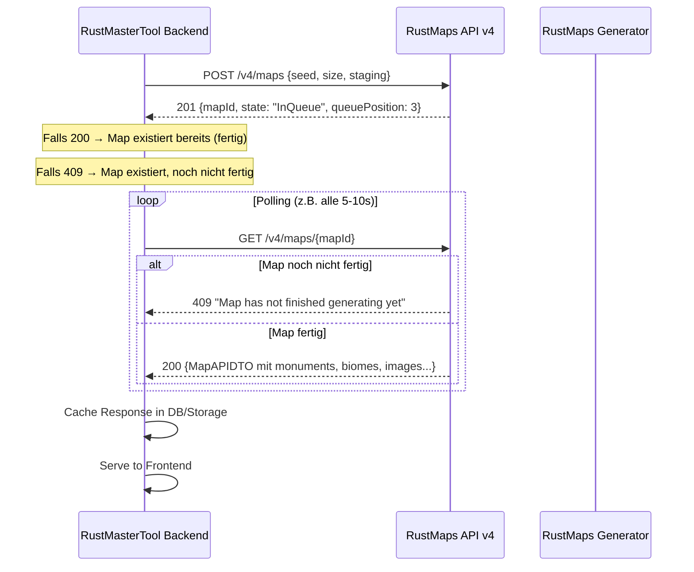

# RustMaps Generation Flow Audit

**Branch:** `feature/rustmaps-generation-flow-audit`
**Datum:** 2026-07-08
**Autor:** AI Engineering Audit (Senior Backend/API Integration Engineer)
**Status:** Research-only — kein Code geändert

---

## 1. Geprüfte Quellen

| Quelle | Typ | URL |
|--------|-----|-----|
| RustMaps Public API v4 Swagger | Offizielle API-Dokumentation | `https://api.rustmaps.com/swagger/v4-public/swagger.json` |
| Owner Network-Tab Beobachtungen | Interne API (Dashboard) | `https://api.rustmaps.com/internal/v1/maps/{mapId}/status` |
| rustmaps-cli (maintc) | Inoffizielles Open-Source CLI | `https://github.com/maintc/rustmaps-cli` |
| rust-maps-api (Ortovoxx) | Community API Wrapper (v2) | `https://github.com/Ortovoxx/rust-maps-api` |
| RustMaps Pricing | Kommerzielle Limits | `https://rustmaps.com/pricing` |

---

## 2. Beobachtete Interne Endpoints (Dashboard)

> [!CAUTION]
> Diese Endpoints stammen aus dem Owner-Network-Tab auf `https://rustmaps.com/dashboard/generator`.
> Ein versehentlich kopierter Bearer Token wurde als **kompromittiert** behandelt.
> **Keine Tokens, Cookies, Sessions oder API-Keys wurden gespeichert oder in diesen Report übernommen.**

### 2.1 Status-Polling Endpoint

```
GET https://api.rustmaps.com/internal/v1/maps/{mapId}/status
Authorization: Bearer <REDACTED>
Origin: https://rustmaps.com
```

**Response (während Generierung):**
```json
{
  "meta": { "status": "Success", "statusCode": 200 },
  "data": {
    "mapId": "<mapId>",
    "state": "Generating",
    "currentStep": "Generating Terrain",
    "lastGeneratorPingUtc": "2026-07-08T14:53:33.177952Z"
  }
}
```

### 2.2 Map-Detail-Abruf (während Generierung)

```
GET https://api.rustmaps.com/internal/v1/maps/{mapId}
```

**Response (409 — Map noch nicht fertig):**
```json
{
  "meta": {
    "status": "Failed",
    "statusCode": 409,
    "errors": ["Map has not finished generating yet"]
  },
  "data": { "id": "<mapId>" }
}
```

### 2.3 Beobachtete Header-Eigenschaften

| Header | Wert | Bedeutung |
|--------|------|-----------|
| `Authorization` | `Bearer <REDACTED>` | User-Session JWT — **NICHT für Third-Party nutzbar** |
| `access-control-allow-origin` | `https://rustmaps.com` | CORS erlaubt **nur** rustmaps.com |
| `access-control-allow-credentials` | `true` | Cookie/Session-basiert |
| `x-staging-enabled` | `false` | Staging-Branch-Flag |

---

## 3. Public API v4 — Vollständige Endpoint-Analyse

> [!IMPORTANT]
> Die **offizielle public API v4** bietet einen **vollständig dokumentierten Generation Flow** mit API-Key-Auth.
> Dies ist der **einzige sichere und legale Weg** für Third-Party-Integration.

### 3.1 Auth-Methode

```
Header: X-API-Key: <api-key>
Type: apiKey
Location: header
```

**Kein Bearer Token. Kein OAuth. Kein Cookie. Reiner API-Key.**

### 3.2 Verfügbare Endpoints

| Endpoint | Method | Zweck | Auth | Premium |
|----------|--------|-------|------|---------|
| `POST /v4/maps` | POST | Procedural Map generieren (seed + size) | API-Key | ✗ |
| `POST /v4/maps/custom` | POST | Custom Map generieren | API-Key | ✓ (`subscription-required`) |
| `POST /v4/maps/custom/saved-config` | POST | Custom Map aus gespeicherter Config | API-Key | ✓ |
| `GET /v4/maps/{mapId}` | GET | Map-Details abrufen (nach Generation) | API-Key | ✗ |
| `GET /v4/maps/{size}/{seed}` | GET | Map per Seed+Size abrufen | API-Key | ✗ |
| `GET /v4/maps/url` | GET | Map per Download-URL finden | API-Key | ✗ |
| `GET /v4/maps/limits` | GET | Aktuelle Gen-Limits prüfen | API-Key | ✗ |
| `POST /v4/maps/search` | POST | Maps suchen (Filter, Biomes, Monuments) | API-Key | ✗ |
| `GET /v4/maps/filter/{filterId}` | GET | Maps per Filter-ID | API-Key | ✗ |
| `POST /v4/maps/upload` | POST | .map Datei hochladen | API-Key | ✗ |
| `GET /v4/maps/{mapId}/settings` | GET | Custom Map Settings abrufen | API-Key | ✓ |
| `GET /v4/maps/custom` | GET | Default Custom Config | API-Key | ✓ |
| `GET /v4/maps/custom/saved-configs` | GET | Alle gespeicherten Configs | API-Key | ✗ |

### 3.3 Generation Request DTO

```json
{
  "size": 2142,      // 1000–6000
  "seed": 1501918500, // > 0
  "staging": false
}
```

### 3.4 Generation Response — MapStatusDTO

```json
{
  "meta": { "status": "Success", "statusCode": 201 },
  "data": {
    "mapId": "<mapId>",
    "queuePosition": 3,
    "state": "InQueue",          // Active | InQueue | Generating | Processing | Uploading
    "currentStep": "Waiting",
    "lastGeneratorPingUtc": "..."
  }
}
```

### 3.5 Bekannte Map States (MapStates enum)

| State | Bedeutung |
|-------|-----------|
| `Active` | Map ist fertig und abrufbar |
| `InQueue` | Map wartet auf Generierung |
| `Generating` | Map wird gerade generiert |
| `Processing` | Post-Processing (Bilder, Tiles, Metadaten) |
| `Uploading` | Ergebnisse werden hochgeladen |

### 3.6 409 Response — "Map has not finished generating yet"

Die 409-Response tritt auf bei `GET /v4/maps/{mapId}` wenn die Map noch nicht `Active` ist.
Das ist **erwartetes Verhalten**, kein Fehler. Man muss pollen bis `state === "Active"`.

### 3.7 Fertige Map — MapAPIDTO (Vollständige Felder)

> [!TIP]
> Die public API liefert nach Abschluss der Generation **Monument-Koordinaten** und **Biome-Daten** als JSON!
> Das ist für uns der **Goldstandard** — wir brauchen keinen eigenen Parser für diese Daten.

```json
{
  "id": "string",
  "type": "string",
  "seed": 1501918500,
  "size": 2142,
  "saveVersion": 0,
  "url": "string",              // RustMaps Viewer URL
  "rawImageUrl": "string",      // Unverarbeitetes Map-Bild
  "imageUrl": "string",         // Annotiertes Map-Bild (mit Monuments)
  "imageIconUrl": "string",     // Bild mit Icon-Overlays
  "thumbnailUrl": "string",     // Thumbnail für Preview
  "isStaging": false,
  "isCustomMap": false,
  "canDownload": true,
  "downloadUrl": "string",      // .map Datei Download
  "totalMonuments": 42,
  "monuments": [                // ← MONUMENT-KOORDINATEN!
    {
      "type": 35,               // MonumentTypes enum (z.B. Airfield=35)
      "coordinates": {
        "x": 1234,              // ← X-Koordinate
        "y": 5678               // ← Y-Koordinate
      },
      "nameOverride": "string"  // Optional: Custom Name
    }
  ],
  "landPercentageOfMap": 55,
  "biomePercentages": {         // ← BIOME-DATEN!
    "s": 15.5,                  // Snow %
    "d": 22.3,                  // Desert %
    "f": 35.2,                  // Forest %
    "t": 18.0,                  // Tundra %
    "j": 9.0                   // Jungle %
  },
  "islands": 3,
  "mountains": 2,
  "iceLakes": 1,
  "rivers": 4,
  "lakes": 2,
  "canyons": 1,
  "oases": 0,
  "buildableRocks": 12,
  "estimatedDeletionDate": "2026-08-08T00:00:00Z"
}
```

### 3.8 Generation Limits DTO

```json
{
  "concurrent": {
    "current": 1,     // Aktuell laufende Generierungen
    "allowed": 2      // Max gleichzeitig (je nach Plan)
  },
  "monthly": {
    "current": 15,    // Diesen Monat generiert
    "allowed": 50     // Max pro Monat (je nach Plan)
  }
}
```

---

## 4. rustmaps-cli Analyse (maintc/rustmaps-cli)

### 4.1 Übersicht

Das CLI ist ein **inoffizielles** Go-basiertes Tool von [Mainloot](https://mainloot.com), das die **offizielle public API** von RustMaps nutzt. Es ist **KEIN lokaler Map-Generator**.

### 4.2 Features laut README

| Feature | Unterstützt | Anmerkungen |
|---------|-------------|-------------|
| Procedural Map Generator | ✅ | Seed + Size, über public API |
| Custom Map Generator | ✅ | Braucht Premium-Subscription |
| Download Maps | ✅ | .map Dateien |
| CSV Bulk Generation | ✅ | Mehrere Maps aus CSV |
| Random Seed | ✅ | CLI generiert zufälligen Seed |
| Staging Branch | ✅ | Für Pre-Release Rust Versionen |
| Saved Config | ✅ | Custom Map Configs |
| Browser Open | ✅ | Maps in Browser öffnen |
| API Key Auth | ✅ | `X-API-Key` Header |

### 4.3 CLI-Nutzung (Schlüssel-Befehle)

```bash
# API Key setzen
rustmaps set-key <API_KEY>

# Procedural Map generieren
rustmaps generate procedural --seed 123456 --size 4000

# Random Seed
rustmaps generate procedural --size 4000

# Custom Map
rustmaps generate custom --seed 123456 --size 4000

# CSV Bulk
rustmaps generate procedural --csv maps.csv

# Download
rustmaps generate procedural --seed 123456 --size 4000 --download

# Download in Verzeichnis
rustmaps generate procedural --seed 123456 --size 4000 --download --dir ./maps
```

### 4.4 API-Nutzung des CLI (abgeleitet)

Das CLI nutzt **ausschließlich** die **public v4 API**:

| Aktion | Endpoint |
|--------|----------|
| Generate Procedural | `POST /v4/maps` |
| Generate Custom | `POST /v4/maps/custom` |
| Generate from Config | `POST /v4/maps/custom/saved-config` |
| Check Status | `GET /v4/maps/{mapId}` (pollt bis `Active`) |
| Check Limits | `GET /v4/maps/limits` |
| Get Map Details | `GET /v4/maps/{mapId}` |
| Download | Nutzt `downloadUrl` aus MapAPIDTO |
| Get Configs | `GET /v4/maps/custom/saved-configs` |

### 4.5 Auth-Methode

- **Header:** `X-API-Key: <api-key>`
- **Speicherung:** Lokal in Config-Datei (OS-spezifisch)
- **KEINE Bearer Tokens, KEINE Cookies, KEINE User-Sessions**

### 4.6 Polling-Strategie (abgeleitet aus README/Flow)

1. `POST /v4/maps` → bekommt `mapId` + `state`
2. Falls `state !== "Active"` → pollt `GET /v4/maps/{mapId}`
3. Bei `409` → Map noch nicht fertig, weiter pollen
4. Bei `200` mit vollständiger `MapAPIDTO` → fertig
5. State-Files werden lokal persistiert für Resume/Retry

### 4.7 Heruntergeladene Dateien

- **Primär:** `.map` Dateien (Rust Server Map-Dateien) via `downloadUrl`
- **Lokal gespeicherte State-Files:** JSON mit mapId, seed, size, status
- **Bilder/Thumbnails:** Werden **nicht** lokal heruntergeladen (nur URLs in Response)
- **Monument-Koordinaten:** Sind in der API-Response enthalten, werden aber nicht separat gespeichert

### 4.8 Disclaimers aus README

- Braucht mindestens **Premium Subscription** für Custom Maps
- Rate-Limits und Concurrency-Limits beachten
- Monthly Generation Limits je nach Plan
- RustMaps wird als **externer Provider** genutzt, nicht lokal

---

## 5. Public API vs Internal API — Bewertung

### 5.1 Vergleich

| Aspekt | Internal API (Dashboard) | Public API v4 |
|--------|-------------------------|---------------|
| Base Path | `/internal/v1/` | `/v4/` |
| Auth | Bearer Token (JWT) | `X-API-Key` Header |
| CORS | `allow-origin: rustmaps.com` | Vermutlich offen für Server-Calls |
| Dokumentation | **NICHT dokumentiert** | **Vollständig dokumentiert (Swagger)** |
| Stabilität | Kann jederzeit brechen | Versioniert (v4) |
| Für Third-Party | **NEIN** | **JA** |
| Generation Flow | Identisch (async) | Identisch (async) |
| Status Polling | `/internal/v1/maps/{mapId}/status` | `GET /v4/maps/{mapId}` (409 = not ready) |
| Map Data | Vermutlich identisch | Vollständig dokumentiert |
| Monument-Koordinaten | Vermutlich ja | **Bestätigt (x, y)** |
| Biome-Daten | Vermutlich ja | **Bestätigt (s, d, f, t, j)** |

### 5.2 Bewertung

> [!IMPORTANT]
> **Die public API v4 deckt unseren gesamten Use Case ab.**
> Es gibt **KEINEN Grund**, die internal API zu nutzen.
> Die internal API ist für das RustMaps Dashboard gedacht und nicht für Third-Party-Nutzung.

---

## 6. Async Generation Flow — Rekonstruktion



### 6.1 Empfohlene Polling-Strategie

| Parameter | Empfehlung | Begründung |
|-----------|------------|------------|
| Initial Delay | 10s | Generation dauert typisch 30-120s |
| Poll Interval | 5-10s | Balance zwischen Aktualität und Rate-Limits |
| Max Timeout | 5 Minuten | Schutz gegen Endlos-Polling |
| Max Retries | 30 | Bei 10s Interval = 5 Minuten |
| Backoff | Linear oder mild exponential | Nach 3x409 auf 15s erhöhen |
| 409 Handling | Normal weiter pollen | Ist erwarteter Status |
| 5xx Handling | Retry mit Backoff | Server-Fehler |
| 401/403 Handling | Abbrechen | API-Key ungültig |

---

## 7. Daten-Verfügbarkeit nach Generation

### 7.1 Bestätigt verfügbar (via public API)

| Datenfeld | Verfügbar | Typ |
|-----------|-----------|-----|
| mapId | ✅ | string |
| seed | ✅ | int |
| size | ✅ | int |
| type | ✅ | string |
| url (RustMaps Viewer) | ✅ | string |
| rawImageUrl | ✅ | string |
| imageUrl (mit Monuments) | ✅ | string |
| imageIconUrl | ✅ | string |
| thumbnailUrl | ✅ | string |
| downloadUrl (.map) | ✅ | string (conditional: canDownload) |
| monuments[] | ✅ | Array mit type + coordinates(x,y) |
| totalMonuments | ✅ | int |
| biomePercentages | ✅ | Object (s,d,f,t,j) |
| landPercentageOfMap | ✅ | int |
| islands/mountains/rivers/lakes/... | ✅ | int (Counts) |
| estimatedDeletionDate | ✅ | datetime |
| isCustomMap | ✅ | bool |
| isStaging | ✅ | bool |
| saveVersion | ✅ | int |

### 7.2 NICHT in der public API

| Datenfeld | Status |
|-----------|--------|
| Roads (Straßenverlauf) | ❌ Nicht in API Response |
| Rivers (Flussverlauf-Koordinaten) | ❌ Nur Count |
| Rails (Schienenverlauf) | ❌ Nicht in API Response |
| Topology/Heightmap | ❌ Nicht in API Response |
| Prefab-Koordinaten (außer Monuments) | ❌ Nicht in API Response |
| Tile-URLs (Leaflet-Tiles) | ❌ Nicht in public API |
| Entity-Spawns | ❌ Nicht in API Response |

### 7.3 Was der Owner noch verifizieren sollte

> [!NOTE]
> Der Owner soll **nach Abschluss einer Generation** im Network-Tab folgende finale Requests prüfen.

**Sichere Anweisung an den Owner:**

1. Warte bis die Map im Dashboard als "fertig" angezeigt wird
2. Öffne den Network-Tab
3. Lade die fertige Map-Seite
4. Prüfe folgende Requests:

Gesucht (ohne Auth-Header posten):
- **URL** und **Method** des finalen Detail-Requests
- **Response-Feldnamen** (nur Feldnamen, keine Werte mit PII)
- Gibt es `tileUrl`, `mapTiles`, `layers`, `overlays`?
- Gibt es `roads`, `rivers`, `rails` als Koordinaten-Arrays?
- Gibt es zusätzliche Bild-URLs (z.B. Heatmap, Biome-Map)?

**NICHT posten:** Authorization, Cookies, personenbezogene Daten.

---

## 8. CORS/Auth/Security-Bewertung

### 8.1 Frontend Direct Call — ❌ NICHT möglich

| Problem | Detail |
|---------|--------|
| CORS | `access-control-allow-origin: rustmaps.com` blockiert andere Origins |
| API-Key Exposure | API-Key darf NICHT ins Frontend |
| Rate-Limiting | Kein Schutz bei Client-seitigem Zugriff |

**Verdict:** Frontend-Direct-Call ist technisch und sicherheitstechnisch **unmöglich**.

### 8.2 Backend Proxy — ✅ EMPFOHLEN

| Aspekt | Bewertung |
|--------|-----------|
| API-Key serverseitig | ✅ Sicher in Edge Function / env vars |
| CORS irrelevant | ✅ Server-to-Server Call |
| Rate-Limiting | ✅ Wir kontrollieren die Requests |
| Caching | ✅ Responses in DB cachebar |
| Polling | ✅ Via Queue/Worker oder Edge Function |

**Verdict:** Backend Proxy via Supabase Edge Function ist der **sichere und offizielle Weg**.

### 8.3 Internal API Nutzung — ❌ NICHT empfohlen

| Risiko | Detail |
|--------|--------|
| Keine Dokumentation | Endpoints können sich jederzeit ändern |
| Bearer Token | Wäre fremder User-Token → AGB-Verstoß |
| CORS-Block | Funktioniert nur von rustmaps.com |
| Kein offizieller Support | Bei Problemen kein Ansprechpartner |
| Rechtlich fragwürdig | Reverse-Engineering interner APIs |

**Verdict:** Internal API **NICHT produktiv nutzen**. Keine Integration ohne offizielle Freigabe.

### 8.4 User-Session/Bearer Token — ❌ VERBOTEN

- **NIEMALS** User-Bearer-Tokens speichern
- **NIEMALS** User-Sessions durchreichen
- **NIEMALS** als OAuth-Proxy fungieren
- **NUR** offizieller API-Key mit Provider-Vertrag

---

## 9. Architektur-Empfehlung

### Option A — Preview-Only Map Viewer (Current State) ✅ SOFORT

- Zeigt Thumbnail via `thumbnailUrl`
- Button "Open full map on RustMaps" → `url`
- Keine eigene Generation
- **Kein API-Key nötig** (URLs sind public)
- **Geringster Aufwand, sofort nutzbar**

### Option B — Official RustMaps Provider ✅ EMPFOHLEN FÜR PHASE 2

```
┌────────────────┐     ┌──────────────────┐     ┌────────────────┐
│   Frontend     │────→│ Edge Function    │────→│ RustMaps API   │
│   (User klickt │     │ (API-Key sicher) │     │ v4 Public      │
│    "Generate") │     │ Queue + Poll     │     │                │
└────────────────┘     └──────────────────┘     └────────────────┘
                              │
                              ▼
                       ┌──────────────────┐
                       │ Supabase DB      │
                       │ Cache: images,   │
                       │ monuments, biomes│
                       └──────────────────┘
```

**Voraussetzungen:**
- RustMaps API-Key (Premium empfohlen)
- Supabase Edge Function als Proxy
- Queue-System für Generation Requests
- Polling-Worker für Status-Updates
- DB-Cache für fertige Map-Daten
- Supabase Storage für gecachete Bilder

**Kosten/Limits:**
- Je nach RustMaps Plan: 50-500 Maps/Monat
- Concurrent Limits: 1-5 gleichzeitig
- Custom Maps: Nur mit Premium/Business
- Procedural Maps: Mit jedem Plan

### Option C — Eigener Generator Service 🔮 LANGFRISTIG

- Input: seed, size, mapType, Rust version
- Output: image + coordinates + topology
- Komplett eigenes Produktfeature
- **Deutlich größerer Aufwand** (Unity/C# Pipeline)
- Unabhängig von RustMaps
- Evtl. Serverowner-Dienstleistung

### Option D — .map Parser (Ergänzend) 🔧

- Für Uploads / Custom Maps / lokale Dateien
- Nicht dasselbe wie Seed-Generator
- Ergänzend sinnvoll für User die eigene Maps haben
- Parsing von .map → Monuments, Heightmap, Prefabs

### Empfohlener Weg

```
Phase 1 (jetzt):     Option A — Preview-Only (Thumbnail + Link)
Phase 2 (nächst):    Option B — RustMaps Provider (API-Key + Backend)
Phase 3 (later):     Option D — .map Parser (Ergänzend)
Phase 4 (langfrist): Option C — Eigener Generator (Wenn Bedarf)
```

---

## 10. Empfehlung für aktuellen Map Viewer Branch

Der aktuelle Map Viewer Branch sollte:

1. **Thumbnails** via public URLs anzeigen (kein API-Key nötig)
2. **"View on RustMaps"** Button mit Link zur Viewer-URL
3. **Monument-Liste** aus gecacheter API-Response anzeigen (falls vorhanden)
4. **Keine eigene Generation** auslösen
5. **Vorbereitung**: Datenmodell für gecachte Map-Daten in DB definieren

---

## 11. Empfehlung für nächste technische Phase

### Phase: RustMaps Provider Integration

1. **API-Key beantragen** bei RustMaps (Premium Plan)
2. **Edge Function** `generate-map` erstellen
3. **DB-Schema** für map_cache Tabelle
4. **Polling-Worker** (Edge Function mit Cron oder Queue)
5. **Frontend** Map Viewer mit echten Koordinaten
6. **Rate-Limit-Guard** im Backend

### Benötigte DB-Tabelle (Vorschlag)

```sql
CREATE TABLE map_cache (
  id UUID DEFAULT gen_random_uuid() PRIMARY KEY,
  rustmaps_id TEXT NOT NULL UNIQUE,
  seed INT NOT NULL,
  size INT NOT NULL,
  type TEXT,
  state TEXT NOT NULL DEFAULT 'pending',
  url TEXT,
  image_url TEXT,
  thumbnail_url TEXT,
  raw_image_url TEXT,
  download_url TEXT,
  can_download BOOLEAN DEFAULT FALSE,
  is_custom_map BOOLEAN DEFAULT FALSE,
  total_monuments INT,
  monuments JSONB,
  biome_percentages JSONB,
  land_percentage INT,
  islands INT,
  mountains INT,
  rivers INT,
  lakes INT,
  estimated_deletion_date TIMESTAMPTZ,
  created_at TIMESTAMPTZ DEFAULT NOW(),
  updated_at TIMESTAMPTZ DEFAULT NOW()
);
```

---

## 12. Security-Hinweise

> [!CAUTION]
> **Sicherheitskritische Regeln — nicht verhandelbar**

1. ✅ Vom Owner versehentlich kopierter Bearer Token wurde als **kompromittiert** behandelt
2. ✅ **Keine Secrets** in diesem Report gespeichert
3. ✅ **Keine API-Keys** im Frontend — nur serverseitig
4. ✅ **Keine fremden Bearer Tokens** nutzen oder speichern
5. ✅ **Keine Internal API** produktiv integrieren ohne offizielle Freigabe
6. ✅ **Nur offizielle public API v4** mit eigenem API-Key nutzen
7. ✅ **Keine automatisierten Requests** die gegen Terms/Rate-Limits verstoßen
8. ✅ Owner sollte den kompromittierten Token bei RustMaps invalidieren/rotieren

---

## 13. Zusammenfassung

### Was sicher bestätigt ist

- ✅ RustMaps hat eine **offizielle public API v4** mit vollständiger Swagger-Dokumentation
- ✅ Die API unterstützt **Procedural Map Generation** (seed + size)
- ✅ Die API liefert **Monument-Koordinaten** (type, x, y) als JSON
- ✅ Die API liefert **Biome-Prozentsätze** (Snow, Desert, Forest, Tundra, Jungle)
- ✅ Die API liefert **Bild-URLs** (raw, annotated, icon, thumbnail)
- ✅ Die API liefert **Download-URL** für .map Dateien
- ✅ Auth funktioniert über `X-API-Key` Header
- ✅ Generation ist **async** mit bekanntem State-Machine-Flow
- ✅ `409` bei noch nicht fertiger Map ist **erwartetes Verhalten**
- ✅ rustmaps-cli bestätigt, dass der **public API Flow produktionsreif** ist
- ✅ `GET /v4/maps/limits` liefert concurrent + monthly Quotas

### Was noch unbekannt ist

- ❓ Exakte Pricing/Limits für die einzelnen Plans
- ❓ Ob Tile-URLs (Leaflet-Tiles) über API verfügbar sind
- ❓ Ob Roads/Rivers/Rails als Koordinaten-Arrays erhältlich sind
- ❓ Ob es eine Webhook-Option gibt (CustomMapSettings hat ein `webhook` Feld)
- ❓ Finale Response-Felder im Dashboard nach Abschluss der Generation

### Kein Code geändert

✅ Dieser Report ist **reine Dokumentation** — kein Quellcode wurde modifiziert.
✅ Kein Production Deploy, kein Supabase Deploy, keine DB Migration.
✅ Kein main push.
